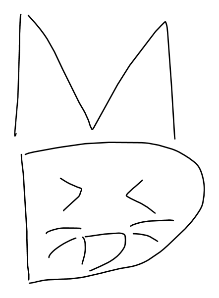

<div align="center">


# MeowD reader 🐱

**가볍고 빠른 오프라인 마크다운 뷰어** — `.md` 더블클릭하면 브라우저 탭에 예쁘게 렌더.

VS Code / Cursor는 너무 무겁다 싶을 때. 스크립트 한 개 + 작은 런처가 전부.

[](LICENSE)

</div>

---

## ✨ 특징

- **오프라인 · 네트워크 0** — 로컬에서 Markdown → HTML 변환, 외부 전송 없음
- 📑 목차(TOC) 사이드바 · 🌓 라이트/다크 토글 · 📋 코드 복사버튼
- ☑️ 체크리스트(`- [ ]`) · 🔢 표 · 🎨 코드 구문 강조 · 🔍 이미지 클릭 확대
- 🧮 **LaTeX 수식** 렌더 (`$...$` · `$$...$$` → MathJax; 네이티브는 오프라인 번들)
- 🖨️ 인쇄/PDF 최적화 (`Ctrl/⌘+P`)
- ✎ **편집 버튼** — 읽기는 브라우저, 편집은 외부 편집기로 (인-브라우저 에디터 없음 = 가벼움)

## 🚀 세 가지 사용법

| 방식 | 대상 | 설치 |
|------|------|------|
| **유니버설 (1파일 HTML)** | 폰 · 맥 · PC 무엇이든 | **없음** — 파일 열어 `.md` 고르면 끝 |
| **Windows 네이티브** | Windows | 빌드 스크립트 1번 |
| **macOS 네이티브** | macOS | 셋업 스크립트 1번 *(experimental)* |

---

### ① 유니버설 — 어떤 기기든, 설치 0

[`universal/md-viewer.html`](universal/md-viewer.html) 과 그 옆 `marked.min.js` 를 같은 폴더에 두고,
`md-viewer.html` 을 브라우저로 열기 → **`.md` 파일을 끌어다 놓거나 "파일 열기"**.

> 폰(사파리·크롬)·맥북·윈도우 전부 동일하게 동작. 두 파일만 같이 있으면 오프라인으로도 됩니다.

### ② Windows 네이티브 — 탐색기 더블클릭 연결

필요: Python 3 + `pip install markdown pygments` (py launcher 포함 권장)

```powershell
# 저장소 폴더에서
.\build.ps1        # md_view.exe / md_edit.exe 컴파일 (csc.exe, Windows 기본 제공)
.\register.ps1     # 탐색기 "연결 프로그램"에 등록 (HKCU, 관리자 불필요)
```
그 뒤 `.md` 우클릭 → 연결 프로그램 → **Markdown 뷰어**. 제거는 `.\unregister.ps1`.

### ③ macOS 네이티브 — `.md` 더블클릭 연결

필요: Python 3 (`brew install python` 등)

```bash
chmod +x mac/setup_mac.command
./mac/setup_mac.command     # markdown/pygments 설치 + .app 생성 + .md 연결
```
> ⚠️ 이 스크립트는 Windows에서 작성돼 **macOS 실테스트 전**입니다. 막히면 위 **유니버설** 방식을 쓰면 설치 없이 바로 됩니다 — 에러는 이슈로 환영합니다.

---

## ✎ 편집 버튼은 어떻게 동작하나

브라우저는 보안상 프로그램을 직접 못 띄웁니다. 그래서 `mdedit:` **커스텀 URL 프로토콜**을 등록해 두고,
편집 버튼이 `mdedit:<경로>` 링크를 열면 작은 핸들러(Win: `md_edit.exe` / mac: `.app`)가 받아 **외부 편집기**로 그 파일을 엽니다. 뷰어 자체는 끝까지 **읽기 전용**이라 가볍습니다.

- Windows 편집기 변경: [`editor.txt`](editor.txt) 첫 줄에 실행파일 경로
- macOS: 기본 텍스트편집기(`open -t`)

> 💡 설치 직후 편집 버튼이 반응 없으면 **브라우저를 완전히 재시작**하세요 — 브라우저가 새 `mdedit:` 프로토콜을 인식하려면 한 번 재시작이 필요합니다. 누르면 뜨는 "열기?" 창은 **허용**. (그래도 안 열리면 버튼이 파일 경로 안내를 띄워줍니다.)

## 🔄 업데이트

이미 설치해 쓰는 중에 패치가 나오면:

- **Windows**: 설치 폴더에서 `.\update.ps1` 실행 → 바뀐 파일만 받아 적용.
  엔진(`md_view.py`) 패치는 **재빌드 없이** `.md` 다시 열면 끝. 런처(`.cs`)·아이콘이 바뀐 경우에만 자동 재빌드. (기본 연결은 안 건드림)
- **유니버설 링크(GitHub Pages)**: **할 일 없음** — 항상 최신이 서빙됩니다. 브라우저만 새로고침.
- **저장소를 직접 clone한 경우**: `git pull`.

## 📁 구성

```
md_view.py        렌더 엔진 (크로스플랫폼: stdlib + markdown + pygments)
icon.ico          앱 아이콘 (MD-cat)
launcher.cs       Windows Open-with 런처 → md_view.py 실행
md_edit.cs        Windows mdedit: 프로토콜 핸들러
build/register/unregister.ps1   Windows 빌드·등록·해제
editor.txt        편집 버튼이 열 편집기 (Windows)
mac/setup_mac.command           macOS 셋업
universal/md-viewer.html        설치 없는 1파일 뷰어 (+ marked.min.js)
```

## 라이선스 / 크레딧

- 코드: [MIT](LICENSE)
- 번들 라이브러리: [marked](https://github.com/markedjs/marked) (MIT) · [Pygments](https://pygments.org) (BSD) · [Python-Markdown](https://python-markdown.github.io) (BSD)

<div align="center">



<sub>made with 🐱 · by <a href="https://github.com/sooneeujuro">@sooneeujuro</a></sub>

</div>
